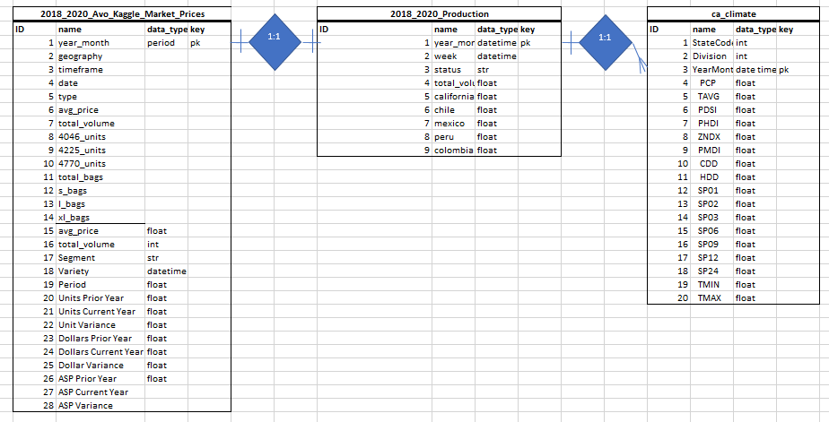
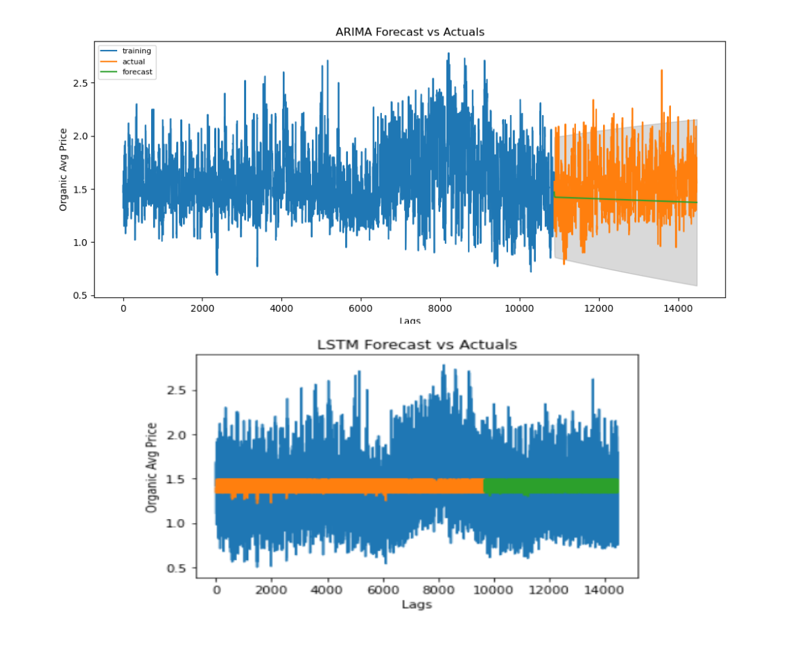
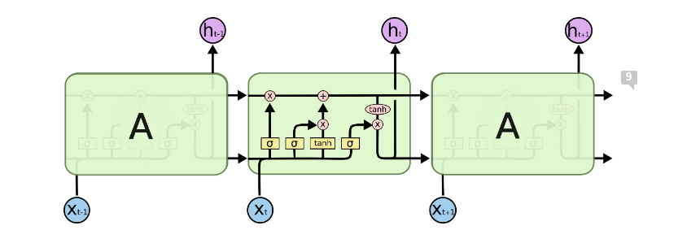
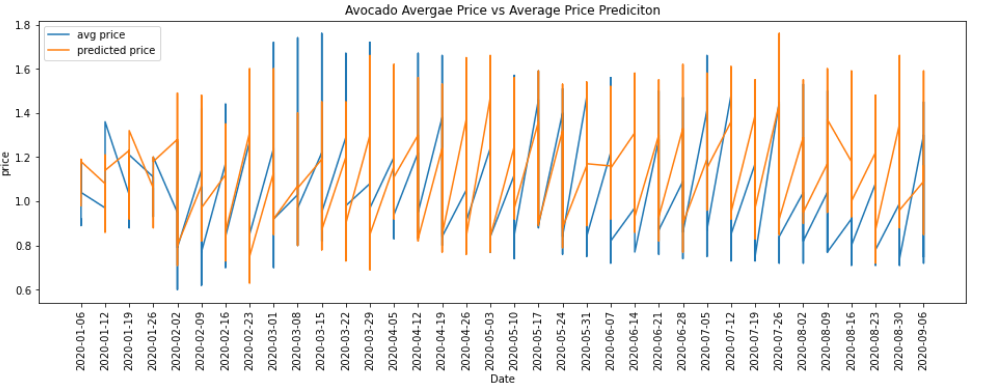
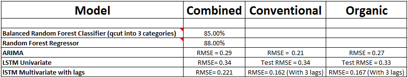
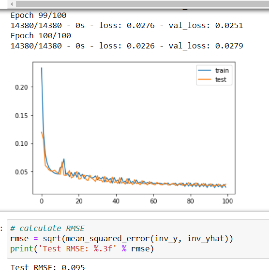
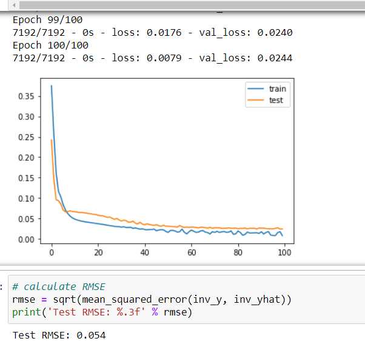
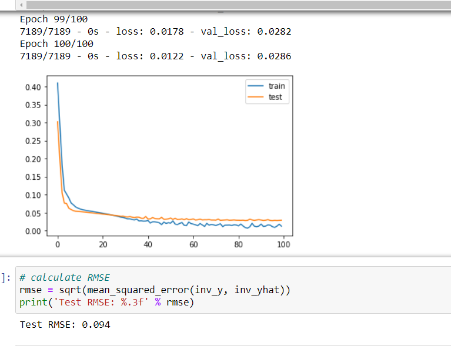

# Health and Avocados

## Overview
Purpose of this project is to use everything we have learned over the period of the course and apply them in predicting the Price of Avocados in California based on the available production, climate, market, and price data, collected for the past 3 years (2018 - 2020). The questions we will be answering in this project are shown below.

 - Does the weather patterns of the current month effect the production of avocados in the future months?
 - Does the production of the avocados effect the prices? 

### Bonus
Furthermore if time permits, we will be correlating the health/dietary benefits of avocado consumption.

 - Does eating avocados help in actual or percieved health benefits for an individual?
 

## Resources
  - Data Source: climate.csv, market.csv, prices.csv, production.csv
  - Software: anaconda3, python 3.7.7, jupyter notebook, JavaScript
  - Database: PostgreSQL
  - Librarys: pandas, numpy, sklearn, tensorflow, os, leaflet, matplotlib, seaborn, sqlalchemy, pmdarima, shap

## Project Outline

We will be using unsupervised machine learning to uncover patterns in our datasets. With our analyses, we would like to find the factors that are effecting avocado prices and avocado production, and uncover trends of avocado prices and avocado production. Then we will start with multiple linear regression to discover the relationship of production with respect to climate, and prices with respect to production, and how we could combine them all. Next step would be to use the random forest ensemble classification to determine the increase or decrease in the avocado prices, and then generate price prediction model using a neural network model.

## Contributors
Contributor | Seg 1 | Seg 2 | Seg 3 | Seg 4
------------|-------|-------|-------|------
Amelin | Circle | Circle, Triangle, Square | Dashboard |
Andreja | Triangle | Circle, Triangle, X | Draft Presentation |
David | Square | Circle, Triangle, Square | Quality Assurance |
Subba | X | Circle, Triangle, Square | Peer Review |

  Circle - database
  
  Triangle - machine learning
  
  Square - repository
  
  X - technology/dashboard
  

## Database

### ERD - Database schema
 - DataSets
   - Climate
     - Columns “StateCode” and “Division” were dropped as they were not relevant
     - The “YearMonth” column was converted from int to datetime period[M]
     
   - Market
     - Columns were renamed to all lowercase with no spaces/replaced with underscores
     - str columns were changed to lowercase, only proper case was kept on the geography column as it contained names of cities/states/regions
     - “year_month” column was added to the dataset as datetime period[M], and columns were reordered
     - “date” column was changed to datetime format
     
   - Prices
     - Columns were renamed to all lowercase with a more descriptive title with no spaces/replaced with underscores
     - str columns were changed to lowercase, only proper case was kept on the geography column as it contained names of cities/states/regions
     - “year_month” column was added to the dataset as datetime period[M], and columns were reordered
     - “date” column was changed to datetime format
     
   - Production
     - Columns were renamed to all lowercase with a more descriptive title with no spaces/replaced with underscores
     - str columns were changed to lowercase
     - “year_month” column was added to the dataset as datetime period[M], and columns were reordered
     - “date” column was changed to datetime format

Datasets loaded into a PostgreSQL database. Entity Relationship Diagram (ERD) shown below
   
 
 Further schema descriptions are shown in this file:  
   ["ERD file"](./ERD/h_a_ERD.xlsx)

### Database cleaning
#### Cleaning
The data was cleaned to the point that it could be joined together as needed while saving all the source data. Primary key 'year_month' is used on each table as a connector.  Date column in each dataset file is in different format and they were all converted to year_month format. Saving the data as sourced is important from a data lineage perspective and provides flexibility to use or drop columns while cleaning the data for machine learning. Column titles were cleaned to make them consistent and proper capitalization was used.

#### Physical Tables
Schema description for tables Prices, Production, and Climate are shown in the ["ERD file"](./ERD/h_a_ERD.xlsx).

#### Source Data ERD
ERD Diagram-Source Data worksheet in the ["ERD file"](./ERD/h_a_ERD.xlsx) is the ERD for initial storage within the database. Given the common and consistent primary key in each of the tables, for this stage all relationships will be one-to-one. The lines depicting the connections represent the ability to join each table to each other tables.

#### Consolidation prior to Extraction
Again, once each table is in the database, we anticipate joining all the price tables into fewer, and possibly one, table. This is shown in the ERD Diagram-Consolidation (["ERD file"](./ERD/h_a_ERD.xlsx)). It is anticipated that further consolidation into one table will be done prior to extraction into Jupyter notebook. Further updates to the ERD are done as we progress to different stages in the project.

## Preprocessing
### Random Forest Ensemble (Regressor and Classifier) on prices and production dataset
The steps for preprocessing the Random Forest Ensemble (Regressor and Classifier) are available here [RFE Model Cleaning Steps](resources/RandomForestEnsemble_PreprocessingSteps.docx)

### ARIMA, LSTM Univariate and LSTM Multivariate Preprocessing Steps
The steps for preprocessing the ARIMA, LSTM Univariate and LSTM Multivariate models is available here ['model Cleaning Steps'](resources/dm_preprocess_steps.docx). The models are available here:
['ARIMA Model'](./ML_models/ARIMA_Price_Prod.ipynb)
['LSTM Univariate'](./ML_models/LSTM_basic_regression_prices.ipynb)
['LSTM Multivariate with Lags'](./ML_models/LSTM_Multivariate_Prices_climate.ipynb)
A definiton of the climate data columns is available here ['climate Data'](resources/drought-readme.txt)

## Model
### Random Forest Ensemble (Regressor and Classifier) on prices and production dataset
#### Overview
One of the ML models used for this project was Random Forest Ensemble (RFE). Before building RFE model, we used Linear Regression with scikit-learn (LR) and Decision Tree Classifier (DTC) for a couple of reasons. LR as a good starting point, helps us understand the relationship between input and output and DTC because it is fast to build & test and can be present visually to uncover hidden trends and to tell the story. After seeing good results in those two models, we moved to RFE. 

RFE combines individual models; therefore, ensemble models are stronger learners, are less bias (more flexible) and have less variance (less data-sensitive). However, when it comes to data that has a time dimension, applying machine learning methods becomes a little tricky. Random forests, like most ML methods, have no awareness of time and they take observations to be independent and identically distributed. We approached to this problem, by splitting the date into weeks, months and years and use those features in ML model as separate X-variables, since we recognized seasonality in the dataset.

***The steps for preliminary feature engineering and decision making for the Random Forest Ensemble (Regressor and Classifier) are available here:*** [RFE Model Feature Engineering](resources/RandomForestEnsemble_FeatureEngeenering.docx)

### ARIMA and LSTM Machine Learning Model
#### Overview
Both an ARIMA and a LSTM model are run as univariate models to predict average avocado prices. Learning about ARIMA for time series led to discovering the LSTM model, which is also supposed to be good at time series. running both models on the same data, we can compare the results from both models and I can learn about LSTM in preparation for applying it to a multivariate model with more then one time lag.

The ARIMA RMSE score is 0.29 for the combined data set, RMSE = 0.21 for the conventional data set and RMSE = 0.21 for the organic data set.  The LSTM model results are: RMSE = 0.34 for combined and conventional and RMSE = 0.33 for organic. See figure x. The model processing steps are available here, ['modeling Steps'](resources/dm_model_steps.docx).

The LSTM model Has the ability to remove or add information to the cell state. These are called gates. at a very high level this is shown in figure 1. Its source is _Understanding LSTM Networks, Colah's blog, 08/27/2015._ (https://colah.github.io/posts/2015-08-Understanding-LSTMs)

### LSTM Multivariate Machine Learning Model with Lags
#### Overview
With a desire to understand if/how climate affects the average price of avocados, a multivariate LSTM model was used to analyze those affects. Further, the features were time lagged to allow the model to potentially use past states to better predict average avocado prices. The multivariate model was optimized at 3 Lags, 100 Neurons and 100 Epochs with the Sgimoid activation. For the combined data set the RMSE was 0.08. Further, 2017 through 2019 data was used to make predicitons for 2020. The RMSE for conventional avocados was 0.05. THe organic dataset resulted in a RMSE of 0.09. Figure x shows a graph of the actual values and compared to the predictions. The model processing steps are available here, ['modeling Steps'](resources/dm_model_steps.docx).

Figure x.

## Presentation
Presentation slides can be found on the following link: [Group Project Presentation Slides](https://docs.google.com/presentation/d/1wviT0-FSyJN_IjDa6qDLE4fgrHu8PXYG84fps1eJmXE/edit?usp=sharing)

## Dashboard
The initial storyboard and blueprint for the dashboard can be found on the following link: [Storyboard](https://docs.google.com/presentation/d/1oUDenIsmbZWGQ2lDN9eox3NoULL2VTAGTj8iRTcmfAI/edit?usp=sharing)

We are creating a dashboard with interactive visualizations using **Tableau**, hosted on Tableau Public. The dashboard can be found [here](https://public.tableau.com/profile/amelin.norzamini#!/vizhome/TheAvocadoStory/TheAvocadoStory).

**Description of interactive elements**
- The Introduction page allows you to pick which section of the dashboard to view just by clicking on it.
- A map with production data that can be filtered by year.
- Hovering over production regions will show the production volume of the selected year(s) and the production trend for the past 3 years.
- Hovering over a specific section of the production map will show a bar chart of the average production by region.
- The price map shows the average selling prices of avocados by city or state and can be filtered by year and the type of avocado.
- A map of US cities that will allow you to hover over and see how the predicted average selling prices compare to the actual selling prices.
- The dashboard itself will have buttons to navigate you to the `Home`, `Previous`, and `Next` pages, including being able to click on certain headings that will bring you to straight to the visualizations.
  
## Summary
### Final ML Models and stats

  

### Random Forest Ensemble (Regressor and Classifier) on prices and production dataset
Our goal is to build and train the model that has high accuracy in predicting prices in various US cities and determine what features are important at predicting prices. Random Forest Ensemble ML model showed promising results in predicting avocado prices in various US cities with R2 score of 0.88 and mean squared error (mse) of 0.01 (Regressor) and accuracy score of 85% (Classifier).

***Please see detailed explanation of results here:*** [RFE Results description](resources/RandomForestEnsemble_Results.docx)

Final code for this model can be found here: [Random Forest Classifier](ML_models/Random_Forest_Classifier_price_and_production_data.ipynb) and [Random Forest Regressor](ML_models/Random_Forest_Regressor_price_and_production_data.ipynb)

### ARIMA and LSTM Univariate Model
Though the ARIMA model doesn't use any features, which could provide useful information, the model is fairly accurate in predicting the average prices of avocados. Additionally, running the combined model doesn't change the RMSE. This indicates my assumption that since the prices are different there would be more variability in average prices for the combined model is incorrect.

###LSTM Multivariate Model
By iterating through a number of lags I found 1 lag produces the best results. The sigmoid activation function produced the best results. By iterating through different features, pulling them out of the model, found the following features hurt the model results: 'phdi','zndx', 'pmdi', 'cdd', 'sp01', 'sp02', 'sp03', 'sp06', 'sp09', 'sp12', 'sp24','tmin', 'tmax'. The results from the combined data set, the dataset for conventional avocado types and the organic avocado type are shown here

Combined

Conventional

Organic

## Next Steps

### Random Forest Ensemble (Regressor and Classifier)
Next step for Random Forest Ensemble (RFE) would be Time Series. Although Time Series were applied in other models for this project, it would still be interesting to see how Time Series affect RFE. We approached to RFE model by considering seasonality, breaking down the date into weeks, months and years. By applying time series, the overall trend would be captured as well. As in almost every data science project majority of the time is spend on cleaning and preparing datasets. Our dataset doesn’t have one unique date. Same date will appear for every city included in the dataset, times 2 because of the two types of avocados (organic and conventional). Suggested approach to this would be split the data by city and by type, apply time series with lags to a smaller dataset with now unique date, and then concatenate datasets. Time dimension, it is a very interesting and fundamental field in data science. More methods that capture time dimension could improve RFE model.

### ARIMA and LSTM Univariate Model
More work to understand seaonality could be done. I ran one ARIM model with it's seasonality feature. Compensating for seasonality makes the conventional model worse but does not change the score for organic. This is interesting given the different growing seasons. 

### LSTM Multivariate Model
LSTM is very interesting. If time permitted, I would try sliding window of time and also try this as a classifier model. Additionally, I found the LSTM requirement for a 3 dimensional datashpe very difficult to use for applying SHAP. I tried using SHAP to predict feature importances. Given the large number of features after encoding and creating time lags, the SHAP funcitonality would not run. It produced errors about single dimensiality in some features. I reduced features so that the SHAP feature perdictor would work but now, some features were not being taken into account. The same 3 dimensional difficulty also came up when I tried to add additional layers to the model. More work in these areas could improve the model. 

