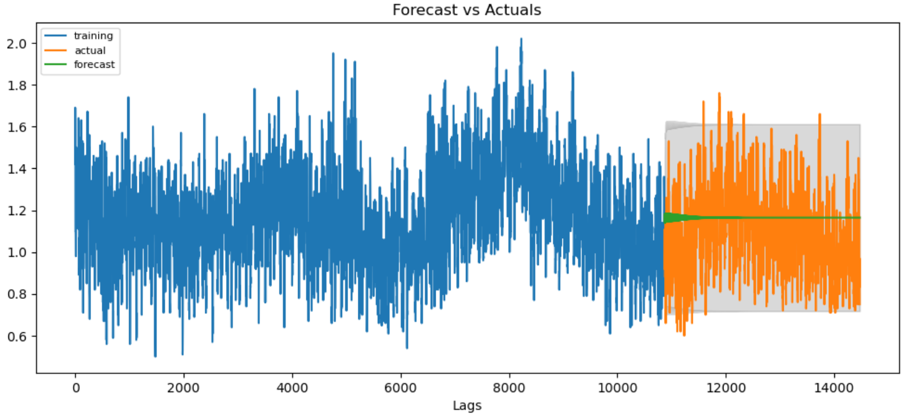
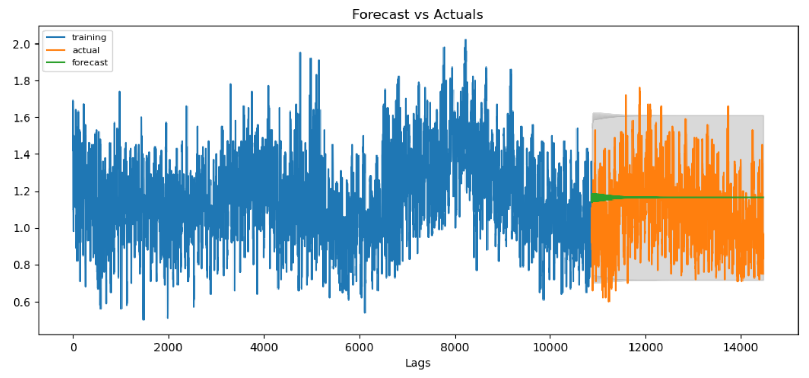
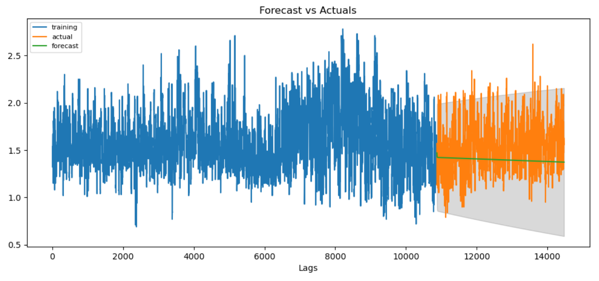
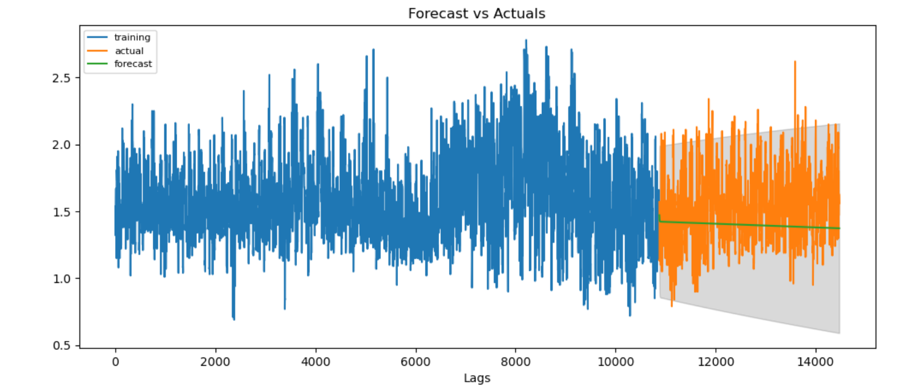

# Health and Avocados

## Overview
Purpose of this project is to use everything we have learned over the period of the course and apply them in predicting the Price of Avocados in California based on the available production, climate, market, and price data, collected for the past 3 years (2018 - 2020). The questions we will be answering in this project are shown below.

 - Does the weather patterns of the current month effect the production of avocados in the future months?
 - Does the production of the avocados effect the prices? 

### Bonus
Furthermore if time permits, we will be correlating the health/dietary benefits of avocado consumption.

 - Does eating avocados help in actual or percieved health benefits for an individual?
 

## Resources
  - Data Source: climate.csv, market.csv, prices.csv, production.csv
  - Software: anaconda3, python 3.7.7, jupyter notebook, JavaScript
  - Database: PostgreSQL
  - Librarys: pandas, sklearn, tensorflow, os, leaflet, matplotlib

## Project Outline

We will be using unsupervised machine learning to uncover patterns in our datasets. With our analyses, we would like to find the factors that are effecting avocado prices and avocado production, and uncover trends of avocado prices and avocado production. Then we will start with multiple linear regression to discover the relationship of production with respect to climate, and prices with respect to production, and how we could combine them all. Next step would be to use the random forest ensemble classification to determine the increase or decrease in the avocado prices, and then generate price prediction model using a neural network model.

### Contributors
Contributor | Seg 1 | Seg 2 | Seg 3 | Seg 4
------------|-------|-------|-------|------
Amelin | Circle | Circle, Triangle, Square | |
Andreja | Triangle | Circle, Triangle, X | |
David | Square | Circle, Triangle, Square | |
Subba | X | Circle, Triangle, Square | |

Circle - database

Triangle - machine learning

Square - repository

X - technology/dashboard

### Communications Protocols
 - Google Docs for tracking checklist based on the rubrics.
 - Google Drive with shared folder and sub folders to add findings to be shared by the group.
 - Zoom Meetings twice a week Monday, and Wednesday + as needed.
 - Slack for daily chats.
 - Weekly responsibilities are shared in Google Sheet. 

### Database Integration

#### Features

Feature|Description         
-------|-----------
Feature1 | Description 1

#### ERD - Database schema
 - DataSets
   - Climate
     - Columns “StateCode” and “Division” were dropped as they were not relevant
     - The “YearMonth” column was converted from int to datetime period[M]
     
   - Market
     - Columns were renamed to all lowercase with no spaces/replaced with underscores
     - str columns were changed to lowercase, only proper case was kept on the geography column as it contained names of cities/states/regions
     - “year_month” column was added to the dataset as datetime period[M], and columns were reordered
     - “date” column was changed to datetime format
     
   - Prices
     - Columns were renamed to all lowercase with a more descriptive title with no spaces/replaced with underscores
     - str columns were changed to lowercase, only proper case was kept on the geography column as it contained names of cities/states/regions
     - “year_month” column was added to the dataset as datetime period[M], and columns were reordered
     - “date” column was changed to datetime format
     
   - Production
     - Columns were renamed to all lowercase with a more descriptive title with no spaces/replaced with underscores
     - str columns were changed to lowercase
     - “year_month” column was added to the dataset as datetime period[M], and columns were reordered
     - “date” column was changed to datetime format

Datasets loaded into a PostgreSQL database. Entity Relationship Diagram (ERD) shown below
   
 
 Further schema descriptions are shown in this file:  
   ["ERD file"](./ERD/h_a_ERD.xlsx)

#### Cleaning
The data was cleaned to the point that it could be joined together as needed while saving all the source data. Primary key 'year_month' is used on each table as a connector.  Date column in each dataset file is in different format and they were all converted to year_month format. Saving the data as sourced is important from a data lineage perspective and provides flexibility to use or drop columns while cleaning the data for machine learning. Column titles were cleaned to make them consistent and proper capitalization was used.

#### Physical Tables
Schema description for tables Prices, Production, and Climate are shown in the ["ERD file"](./ERD/h_a_ERD.xlsx).

#### Source Data ERD
ERD Diagram-Source Data worksheet in the ["ERD file"](./ERD/h_a_ERD.xlsx) is the ERD for initial storage within the database. Given the common and consistent primary key in each of the tables, for this stage all relationships will be one-to-one. The lines depicting the connections represent the ability to join each table to each other tables.

#### Consolidation prior to Extraction
Again, once each table is in the database, we anticipate joining all the price tables into fewer, and possibly one, table. This is shown in the ERD Diagram-Consolidation (["ERD file"](./ERD/h_a_ERD.xlsx)). It is anticipated that further consolidation into one table will be done prior to extraction into Jupyter notebook. Further updates to the ERD are done as we progress to different stages in the project.

### Dashboard

The storyboard and blueprint for the dashboard can be found on the following link: [Storyboard](dashboard\Storyboard.pptx)

Our attempt is to build interactive visualizations with **Tableau** and deploy it via **github pages**. If time permits we would like to add interactive visualizations with JavaScript as well. Our data comes in CSV format. In order to use it in JavaScript and libraries such as Plotly and Leaflet, we will need to convert it to JSON and GeoJson format.

**Description of interactive elements**

- A bar chart with production data that can be filtered by country.
- Word map with production data that shows what countries have the largest production.
- US map of selected regions that shows what regions have the highest or lowest average price and can be filtered by month.
- Word map that shows lines where US avocados are exported and from what countries are imported.
  

### Machine Learning Model
  - Unsupervised ML for classification of our data in order to uncover the patterns/groups.
  - Multiple Linear Regression for avocado prices in selected US cities
    - Production in California(US), Mexico, Peru, Colombia, Chile (=feature or X-variable) and avocado prices (=target or y-variable).
  - Multiple Linear Regression for production
    - Climate data in Southern California (=features or X-variables) and production in Southern California (=target or y-variable).
  - Random Forest Ensemble Regressor and Classifier
    - (Features) X-variables: region, date, units sold, harvested area, production data, climate data, import data, export data, median income.
    - (Target) y-variable: avocado price 
  - Neural Network ML model for avocado prices prediction 
    - (Features) X-variables: region, date, units sold, harvested area, production data, climate data, import data, export data, median income.
    - (Target) y-variable: avocado price 
    - ARIMA time series linear regression on average prices (price_prod table)
    - LSTM time series linear regression on average prices (price_prod table)
    - LSTM Multivariate and recurrent on average prices given unit prices, geography and production (price_prod table)

#### Preprocessing Data for a Neural Network Model

#### Target for the model

#### Features for the model

#### Compile, Train, and Evaluate the Model
  - Model
    
  - Train stats
    
  - Test stats
    
  - Results

#### ARIMA Machine Learning Model
##### Overview
 An ARIMA model was tried as the model is intended for time series forecasting using past values. It additionally can be extended for data that has seasonal considerations. The below analysis is used to forecast average avocado prices for the years 2018 through September 6th of 2020. It is run for conventional avocados and run for Hass avocados. They are done Separately as the prices are different.

#### Data and Environment
##### Data
The information provides average prices for avocados by date and geography areas and various units of production for California and four other countries. The information is data in a pgAdmin Postgres SQL table. This table was created by joining the union of each year's price tables to the union of each year's production tables. the table contains 21 columns and 14,472 rows before cleaning. The table was exported from pgAdmin to a csv file and is available here ["prices_prod"](./Resources/prices_prod.csv)
##### Environment
Environments - pgAdmin 4.24, Jupyter Notebook 6.1.4
Tools/Languages - Python 3.8.5, Pandas, Numpy, collections, pathlib, matplotlib, seaborn, sklearn, statsmodels, dateutil, pmdarima, sqlalchemy, psycopg2
#### Preprocessing
##### Model Description and Definitions

The Auto Regressive Integrated Moving Average (ARIMA) model is a linear recession model based on the lags of a time series univariate series of values to produce predictors. A couple requirements for the model to be effective are:

1. the data series should not be seasonal. Our data appears to have seasonal aspects. To compensate for this seasonal terms are added. This is called a Seasonal ARIMA, or SARIMA.
2. The data needs to be stationary; having non correlated predictors. To increase its stationary condition, differencing is applied.
##### Definitions
 AR = a Auto Regression model
p = the order of the AR term
MA = a moving Average only model
q = the order of the MA term
d = the number of differencing required to make the time series stationary
##### Preprocessing
1. Read in table from PGAdmin
2. Clean the conventional field
3. Create plots to see what the data looks like
4. Split the data into two dataframes; one for conventional avocados and one for Hass avocados
5. Attempt to determine if the data is stationary. Conduct the Dicky Fuller test. H0 = avg\_price is non-stationary. P value was 0.0 so H0 is rejected. Ha, avg\_price is stationary. Note - I still tried differencing to 1. learn and 2. I notice fluctuations in the data; possibly due to seasonality.
6. Looked at the lags visually. Based on this believe p and q should equal 1.
7. Split the data. 75% for training and 25% for test. since the order of the data must be maintained, did not randomly split.
8. Created a model with p = 1, q = 1, d = 1 and tried it on total data set. P value was 0.0
9. Used auto arima which sequences through the different p, and q options to minimize Akaike Information Criteria (AIC). A statistical method that quantifies goodness of fit. This produces a model with p =3, d = 0, q = 3.
10. Created a forecast from the test data. See Figure x

11. Accuracy metrics are generated. Mean Absolut Percentage Error (MAPE) = 0.18 and Mean Absolute Error (MAE) = 0.18
12. Fit model to deal with for seasonal effects and run auto Arima fin find bets model. Best model is p = 2, d = 0, q = 0.
13. Created a forecast from the test data. See Figure x+1.

14. Accuracy metrics are generated. Mean Absolut Percentage Error (MAPE) = 0.18 and Mean Absolute Error (MAE) = 0.18. Not much change from the non-seasonal model.
15. Repeat the above process for Hass Avocados
16. Dicky fuller p = 0.0, (1,1,1) model MAPE = 0.15, MAE = 0.25. See figure x+2

17. Seasonal auto ARIMA best model is (2,0,0). MAPE = 0.15, MAE = 0.24. ee figure x+3

 #### ARIMA Summary
Though the ARIMA model doesn't use any features, which could provide useful information, the model does accurately predict the average prices of avocados. Further, compensating for seasonality does not improve the model results. I believe these results will be a good gauge against the results of other models like LSTM and Random Forest Classifier for time series.
#### Next Steps
Next steps are to create a multivariate LSTM model with lags and use recurrency. Status is that a basic univariate LSTM regression has been created. This is being fine tuned to provide a comparison to the ARIMA model and to learn about LSTM. Coding is in progress on the multivariate LSTM model. 
   
   
#### Random Forest Ensemble (Regressor and Classifier)
Code for Random Forest Ensemble on the following link: [Random_Forest_Ensamble.ipynb](Random_Forest_Ensamble.ipynb)

##### Overview
Before the Random Forest Ensemble (RFE) ML model, Linear Regression with scikit-learn (LR) and Decision Tree Classifier (DTC) were used for a couple of reasons. LR as a good starting point, helps us understand the relationship between input and output and DTC because it is fast to build & test and can be present visually to uncover hidden trends and to tell the story. 

RFE combines individual models; therefore, ensemble models are stronger learners, are less bias (more flexible) and have less variance (less data-sensitive). However, when it comes to data that has a time dimension, applying machine learning methods becomes a little tricky. Random forests, like most ML methods, have no awareness of time. On the contrary, they take observations to be independent and identically distributed. This assumption is obviously violated in time series data which is characterized by serial dependence.

##### Dataset
For this model two different datasets were combined - prices and production. y-variable (target value) is the average price of the avocados in the US cities. X-variables are month and week, units sold (3 different types), bags sold (3 different types), production data for avocados in the following countries California, Chile, Peru, Mexico, Colombia. 

##### Preliminary data preprocessing

•	Converting date datetime datatype and extracting month and week from the datetime (for the analysis purposes/seasonality).
•	Drop NaN values.
•	Dropping non-beneficial columns and handling outliers.

##### Preliminary feature engineering and preliminary feature selection and splitting data into training and testing sets

•	Encoding strings.
•	Running the model with various combinations of X_values (features) and analyzing how the model performs.
•	Normalizing data set, using Standard Scaler.
•	Splitting data into training and testing at 75% and 25% respectively. 
•	For the classification model continuous y-value was categorized with qcut() function.

##### Summary (Results)

"R squared", is the proportion of the variance in the dependent variable that is predictable from the independent variable(s). Mean square error (MSE) is the average of the square of the errors. The larger the number the larger the error. Based on a rule of thumb, it can be said that RMSE values between 0.2 and 0.5 shows that the model can relatively predict the data accurately.
 

 

 

<i>Random Forest Regressor and Classifier Scores</i>

   
## Summary
