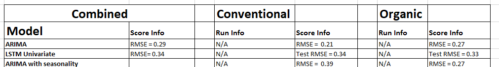

# Health and Avocados

## Overview
Purpose of this project is to use everything we have learned over the period of the course and apply them in predicting the Price of Avocados in California based on the available production, climate, market, and price data, collected for the past 3 years (2018 - 2020). The questions we will be answering in this project are shown below.

 - Does the weather patterns of the current month effect the production of avocados in the future months?
 - Does the production of the avocados effect the prices? 

### Bonus
Furthermore if time permits, we will be correlating the health/dietary benefits of avocado consumption.

 - Does eating avocados help in actual or percieved health benefits for an individual?
 

## Resources
  - Data Source: climate.csv, market.csv, prices.csv, production.csv
  - Software: anaconda3, python 3.7.7, jupyter notebook, JavaScript
  - Database: PostgreSQL
  - Librarys: pandas, sklearn, tensorflow, os, leaflet, matplotlib

## Project Outline

We will be using unsupervised machine learning to uncover patterns in our datasets. With our analyses, we would like to find the factors that are effecting avocado prices and avocado production, and uncover trends of avocado prices and avocado production. Then we will start with multiple linear regression to discover the relationship of production with respect to climate, and prices with respect to production, and how we could combine them all. Next step would be to use the random forest ensemble classification to determine the increase or decrease in the avocado prices, and then generate price prediction model using a neural network model.

### Contributors
Contributor | Seg 1 | Seg 2 | Seg 3 | Seg 4
------------|-------|-------|-------|------
Amelin | Circle | Circle, Triangle, Square | |
Andreja | Triangle | Circle, Triangle, X | |
David | Square | Circle, Triangle, Square | |
Subba | X | Circle, Triangle, Square | |

Circle - database

Triangle - machine learning

Square - repository

X - technology/dashboard

### Communications Protocols
 - Google Docs for tracking checklist based on the rubrics.
 - Google Drive with shared folder and sub folders to add findings to be shared by the group.
 - Zoom Meetings twice a week Monday, and Wednesday + as needed.
 - Slack for daily chats.
 - Weekly responsibilities are shared in Google Sheet. 

### Database Integration

#### Features

Feature|Description         
-------|-----------
Feature1 | Description 1

#### ERD - Database schema
 - DataSets
   - Climate
     - Columns “StateCode” and “Division” were dropped as they were not relevant
     - The “YearMonth” column was converted from int to datetime period[M]
     
   - Market
     - Columns were renamed to all lowercase with no spaces/replaced with underscores
     - str columns were changed to lowercase, only proper case was kept on the geography column as it contained names of cities/states/regions
     - “year_month” column was added to the dataset as datetime period[M], and columns were reordered
     - “date” column was changed to datetime format
     
   - Prices
     - Columns were renamed to all lowercase with a more descriptive title with no spaces/replaced with underscores
     - str columns were changed to lowercase, only proper case was kept on the geography column as it contained names of cities/states/regions
     - “year_month” column was added to the dataset as datetime period[M], and columns were reordered
     - “date” column was changed to datetime format
     
   - Production
     - Columns were renamed to all lowercase with a more descriptive title with no spaces/replaced with underscores
     - str columns were changed to lowercase
     - “year_month” column was added to the dataset as datetime period[M], and columns were reordered
     - “date” column was changed to datetime format

Datasets loaded into a PostgreSQL database. Entity Relationship Diagram (ERD) shown below
   
 
 Further schema descriptions are shown in this file:  
   ["ERD file"](./ERD/h_a_ERD.xlsx)

#### Cleaning
The data was cleaned to the point that it could be joined together as needed while saving all the source data. Primary key 'year_month' is used on each table as a connector.  Date column in each dataset file is in different format and they were all converted to year_month format. Saving the data as sourced is important from a data lineage perspective and provides flexibility to use or drop columns while cleaning the data for machine learning. Column titles were cleaned to make them consistent and proper capitalization was used.

#### Physical Tables
Schema description for tables Prices, Production, and Climate are shown in the ["ERD file"](./ERD/h_a_ERD.xlsx).

#### Source Data ERD
ERD Diagram-Source Data worksheet in the ["ERD file"](./ERD/h_a_ERD.xlsx) is the ERD for initial storage within the database. Given the common and consistent primary key in each of the tables, for this stage all relationships will be one-to-one. The lines depicting the connections represent the ability to join each table to each other tables.

#### Consolidation prior to Extraction
Again, once each table is in the database, we anticipate joining all the price tables into fewer, and possibly one, table. This is shown in the ERD Diagram-Consolidation (["ERD file"](./ERD/h_a_ERD.xlsx)). It is anticipated that further consolidation into one table will be done prior to extraction into Jupyter notebook. Further updates to the ERD are done as we progress to different stages in the project.

### Dashboard
The storyboard and blueprint for the dashboard can be found on the following link: [Storyboard](dashboard/Storyboard.pptx)

We are creating a dashboard with interactive visualizations using **Tableau**, hosted on Tableau Public. The dashboard can be found [here](https://public.tableau.com/profile/amelin.norzamini#!/vizhome/TheAvocadoStory/TheAvocadoStory).

**Description of interactive elements**
- The Introduction page allows you to pick which section of the dashboard to view just by clicking on it.
- A map with production data that can be filtered by year.
- Hovering over production regions will show the production volume of the selected year(s) and the production trend for the past 3 years.
- Hovering over a specific section of the production map will show a bar chart of the average production by region.
- The price map shows the average selling prices of avocados by city or state and can be filtered by year and the type of avocado.
- A map of US cities that will allow you to hover over and see how the predicted average selling prices compare to the actual selling prices.
- The dashboard itself will have buttons to navigate you to the `Home`, `Previous`, and `Next` pages, including being able to click on certain headings that will bring you to straight to the visualizations.
  

### Machine Learning Model
  - Unsupervised ML for classification of our data in order to uncover the patterns/groups.
  - Multiple Linear Regression for avocado prices in selected US cities
    - Production in California(US), Mexico, Peru, Colombia, Chile (=feature or X-variable) and avocado prices (=target or y-variable).
  - Multiple Linear Regression for production
    - Climate data in Southern California (=features or X-variables) and production in Southern California (=target or y-variable).
  - Random Forest Ensemble Regressor and Classifier
    - (Features) X-variables: region, date, units sold, harvested area, production data, climate data, import data, export data, median income.
    - (Target) y-variable: avocado price 
  - Neural Network ML model for avocado prices prediction 
    - (Features) X-variables: region, date, units sold, harvested area, production data, climate data, import data, export data, median income.
    - (Target) y-variable: avocado price 
    - ARIMA time series linear regression on average prices (price_prod table)
    - LSTM time series linear regression on average prices (price_prod table)
    - LSTM Multivariate and recurrent on average prices given unit prices, geography and production (price_prod table)

#### Final ML Models and stats

  

#### Preprocessing Data for a Neural Network Model

#### Target for the model

#### Features for the model

#### Compile, Train, and Evaluate the Model
  - Model
    
  - Train stats
    
  - Test stats
    
  - Results

#### ARIMA and LSTM Machine Learning Model
##### Overview
Both an ARIMA and a LSTM model are run as univariate models to predict average avocado prices. Learning about ARIMA for time series led to discovering the LSTM model, which is also supposed to be good at time series. running both models on the same data, we can compare the results from both models and I can learn about LSTM in preparation for applying it to a multivariate model with more then one time lag.
#### Data and Environment
##### Data
The information provides average prices for avocados by date and geography areas and various units of production for California and four other countries. The information is data in a pgAdmin Postgres SQL table. This table was created by joining the union of each year's price tables to the union of each year's production tables. the table contains 21 columns and 14,472 rows before cleaning. The table was exported from pgAdmin to a csv file and is available here ["prices_prod"](./Resources/prices_prod.csv)
##### Environment
Environments - pgAdmin 4.24, Jupyter Notebook 6.1.4
Tools/Languages - Python 3.8.5, Pandas, Numpy, collections, pathlib, matplotlib, seaborn, sklearn, statsmodels, dateutil, pmdarima, sqlalchemy, psycopg2
#### Preprocessing
##### Model Description and Definitions
The Auto Regressive Integrated Moving Average (ARIMA) model is a linear recession model based on the lags of a time series univariate series of values to produce predictors. A couple requirements for the model to be effective are:
1. the data series should not be seasonal. Our data appears to have seasonal aspects. To compensate for this seasonal terms are added. This is called a Seasonal ARIMA, or SARIMA.
2. The data needs to be stationary; having non correlated predictors. To increase its stationary condition, differencing is applied.
The LSTM model Has the ability to remove or add information to the cell state. These are called gates. at a very high level this is shown in figure 1. Its source is \_Understanding LSTM Networks, Colah's blog, 08/27/2015. !(https://colah.github.io/posts/2015-08-Understanding-LSTMs)

Figure 1

##### ARIMA Definitions
AR = a Auto Regression model
p = the order of the AR term
MA = a moving Average only model
q = the order of the MA term
d = the number of differencing required to make the time series stationary
##### Preprocessing
1. Read in table from PGAdmin
2. Clean the conventional field
3. Create plots to see what the data looks like
4. Split the data into two dataframes; one for conventional avocados and one for Hass avocados. These along with the complete dataset (both types) will be modeled
5. ARIMA only - Attempt to determine if the data is stationary. Conduct the Dicky Fuller test. H0 = avg_price is non-stationary. P value was 0.0 so H0 is rejected. Ha, avg_price is stationary. Note - I still tried differencing to 1. learn and 2. I notice fluctuations in the data; possibly due to seasonality.
6. ARIMA only - Looked at the lags visually. Based on this believe p and q should equal 1.
7. Split the data. 75% for training and 25% for test. since the order of the data must be maintained, did not randomly split.
8. ARIMA only - Created a model with p = 1, q = 1, d = 1 and tried it on total data set. P value was 0.0
9. ARIMA only - Used auto arima which sequences through the different p, and q options to minimize Akaike Information Criteria (AIC). A statistical method that quantifies goodness of fit. This produces a model with p =3, d = 0, q = 3. Since "d" is 0, this also confirms the Dicky Fuller test that avg price is non-stationary.
10. Created a forecast from the test data for both ARIMA and LSTM. See Figure 2.

Figure 2

11. The ARIMA model's have a number of scoring metrics but the LSTM models are scored on Root Mean Square Error (RMSE). The ARIMA RMSE score is 0.21. This model is also based on using auto arima which uses the best model having p = 3, d = 0, q = 3.

12. LSTM models are scored on Root Mean Square Error (RMSE). By iterating through LSTM neurons and epochs, which did not change the results significantly, I found the results to be Train Score = 0.34 and Test Score = 0.34.
13. This process was then repeated for organic average prices. See figure 3.

Figure 3

16. The ARIMA model was run with p=2, d=0, q=0. The RMSE score was 0.27
17. The LSTM model's RSE score was Train = 0.34, Test = 0.33
18. Adjusting for seasonality in ARIMA. Both conventional and organic models were run with seasonality turned on. For conventional the RMSE score was 0.39. For organic the RTMSE score was 0.27
19. Finally, a combined, both types was run with p=3, d=0, q=2 based off of the autoarima recommendation. The RMSE score was 0.29.

#### Summary
Though the ARIMA model doesn't use any features, which could provide useful information, the model does accurately predict the average prices of avocados. Further, compensating for seasonality makes the conventional model worse but doe snot change the score for organic. This is interesting given the different growing seasons. Additionally, running the combined model doesn't change the RMSE. This indicates my assumption that since the prices are different there would be more variability in average prices for the combined model is incorrect.

The LSTM model was also good but not great. Based on the closeness of scores between the two models I believe the results are fairly accurate.

Table 1.

#### Next Steps

Next steps are to create a multivariate LSTM model with lags and use recurrency in order to take advantage of features.

#### LSTM Multivariate Machine Learning Model with Lags
##### Overview
With a desire to understand if/how climate affects the average price of avocados, a multivariate LSTM model was used to analyze those affects. Further, the features were time lagged to allow the model to potentially use past states to better predict average avocado prices.

#### Data and Environment

##### Data

The information provides average prices for avocados by date and geography areas. This table was joined to climate data. The climate data covers California. For a full definition of the terms used in this table please refer to ['climate readme'](./Resources/drought-readme.txt). The joined table is available here ['prices and climate'](./Resources/prices_clim_mod.csv)

As an overview, the climate data provides, precipitation, average along with maximum and minimum temperatures. It also provides a number of drought and hydrological indexes.
##### Environment
Environments - pgAdmin 4.24, Jupyter Notebook 6.1.4
Tools/Languages - Python 3.8.5, Pandas, Numpy, collections, pathlib, matplotlib, seaborn, sklearn, statsmodels, dateutil, pmdarima, sqlalchemy, psycopg2, SHAP, LSTM
#### Preprocessing
##### Model Description and Definitions
This LSTM model contains two models. The first model is statically set for 1 lag. The lags on the 2nd model are adjustable.. That is, you can set how many steps back are used in the model to make its predictions. Between 1 to 4 lags were used with the best results generally at 4 lags. The model is a sequential model with 1 input layer containing a number of neurons. I found 100 neurons to be optimal. It also contains a dense output layer. It was complied with mean absolute error loss and uses adam as its optimizer. From what I could find, and consistent with the univariate LSTM model and the ARIMA model, the method to judge the goodness of fit is the Root Mean Square Error (RMSE).

I ran and optimized the model for three data sets; the full prices/climate data, the prices/climate data restricted to type = conventional and the prices/climate data restricted to type = organic.

##### Preprocessing
Please refer to the ['prices climate LSTM code'](LSTM_Multivariate_Prices_climate) for the following steps:

1. Read in the prices_clim data from PDAdmin
2. Dropped non-beneficial columns; year_month, price_total_volume and total_bags. year\_month is not needed as date is available. price_total_volume is the sum of units_4046, units_4225 and units_4770 and total_bags. Total_bags is the sum of s_bags, l_bags and xl_bags. It would be redundant information to double count those parameters and unfairly skew the model.
3. For the same reasoning, I dropped those rows that are totals of underlying sub areas (cities/regions).
4. Corrected the type column. It had two formats for Conventional. Should be one.
5. Split the data out into prices/climate data restricted to type = conventional and the prices/climate data restricted to type = organic. There are now three dataframes.
6. Viewed the data to look for trends. Noticed an increase in average prices in the summer months. Noticed an increase in average temperatures in the summer months, which seems obvious. I'm not saying there is a correlation between the two but definitely similarities. Will come back to this in the results section.
7. I saved the three cleaned files for continued use.
##### Model Steps
1. Defined a function for creating lags, series\_to\_supervised. This transposes and shifts the parameter to the same row but next column. t, t-1, t-2, etc. Doing this introduces Nan's in the bottom rows equal to the number of lags so the function drops those rows.
2. Read in the cleaned data.
3. generate the categorical variables and encodes them.
4. Scale the data using MinMaxScaler.
5. for the 2nd model, create an extra variable to allow changing the number of lags used.
6. use series\_to\_supervised to create the lags.
7. Drop the columns we do not want to predict. We want to predict avg_price, with is t1. For multiple lags we do not drop the extra T1's.
8. Split the data for training and testing. Because we're looking at the previous value to determine the impact of the current value we split the data by time, meaning we will use the 2017 through 2019 data to predict 2020. 2020 data goes from Jan 6th through sept. 9th.
9. reshape the data into a 3 dimensional dataset. samples, timesteps, features. LSTM requires this.
10. instantiate the model.
11. fit the training data. Note I iterated through various combinations of neurons, epochs, batch sizes and activation functions.
12. plot the train vs test loss,
13. predict the average prices.
14. Invert the scaling for both the forecast and the actual data.
15. Calculate the RMSE.
16. Merge the predictions with original features to graph actual vs predictions.
#### Summary
By iterating through the number lags. I found 3 to 4 lags, depending on which dataset was run, produced the best results. The sigmoid activation function produced the best results. By iterating through different features, pulling them out of the model, found the following features hurt the model results: 'phdi','zndx', 'pmdi', 'cdd', 'sp01', 'sp02', 'sp03', 'sp06', 'sp09', 'sp12', 'sp24','tmin', 'tmax'.

Best Model Results

Table 2.

#### Recommended Future Steps
LSTM is very interesting. If time permitted, I would try sliding window of time and also try this as a classifier model. 
   
   
#### Random Forest Ensemble (Regressor and Classifier)
Code for Random Forest Ensemble on the following link: [Random_Forest_Ensamble.ipynb](Random_Forest_Ensamble.ipynb)

##### Overview
Before the Random Forest Ensemble (RFE) ML model, Linear Regression with scikit-learn (LR) and Decision Tree Classifier (DTC) were used for a couple of reasons. LR as a good starting point, helps us understand the relationship between input and output and DTC because it is fast to build & test and can be present visually to uncover hidden trends and to tell the story. 

RFE combines individual models; therefore, ensemble models are stronger learners, are less bias (more flexible) and have less variance (less data-sensitive). However, when it comes to data that has a time dimension, applying machine learning methods becomes a little tricky. Random forests, like most ML methods, have no awareness of time. On the contrary, they take observations to be independent and identically distributed. This assumption is obviously violated in time series data which is characterized by serial dependence.

##### Dataset
For this model two different datasets were combined - prices and production. y-variable (target value) is the average price of the avocados in the US cities. X-variables are month and week, units sold (3 different types), bags sold (3 different types), production data for avocados in the following countries California, Chile, Peru, Mexico, Colombia. 

##### Preliminary data preprocessing

•	Converting date datetime datatype and extracting month and week from the datetime (for the analysis purposes/seasonality).
•	Drop NaN values.
•	Dropping non-beneficial columns and handling outliers.

##### Preliminary feature engineering and preliminary feature selection and splitting data into training and testing sets

•	Encoding strings.
•	Running the model with various combinations of X_values (features) and analyzing how the model performs.
•	Normalizing data set, using Standard Scaler.
•	Splitting data into training and testing at 75% and 25% respectively. 
•	For the classification model continuous y-value was categorized with qcut() function.

##### Summary (Results)

"R squared", is the proportion of the variance in the dependent variable that is predictable from the independent variable(s). Mean square error (MSE) is the average of the square of the errors. The larger the number the larger the error. Based on a rule of thumb, it can be said that RMSE values between 0.2 and 0.5 shows that the model can relatively predict the data accurately.
 

 

 

<i>Random Forest Regressor and Classifier Scores</i>

   
## Summary
